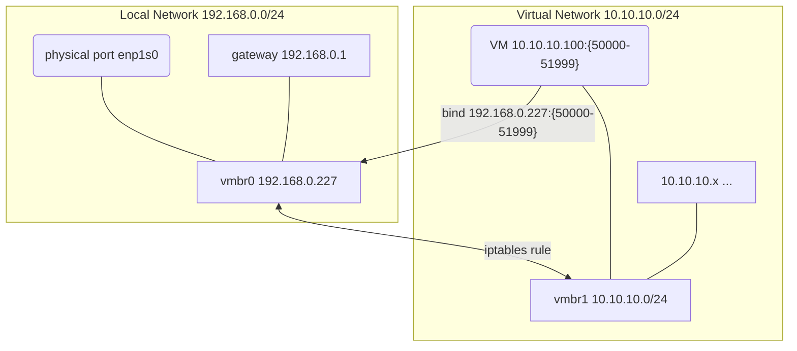

记录一下为 5825U 双网口工控机安装并使用PVE(All in Boom)的过程, 分享给需要参考安装和使用的读者!

<!--more-->

> 安装版本: 8.0-4
>
> 包含一部分 PVE8 (Debian 12) 特有的配置项 和 大部分 Linux 基操 和 常见软件配置使用

# 学习文档

- [Promxox VE 中文文档](https://pve-doc-cn.readthedocs.io/zh_CN/latest/index.html)
- 一键脚本参考 [pve/pve.sh at main · shidahuilang/pve (github.com)](https://github.com/shidahuilang/pve/blob/main/pve.sh)
- 新手教程 1 https://foxi.buduanwang.vip/pve/
- 开源虚拟化管理平台 Proxmox VE https://www.bilibili.com/read/readlist/rl630770

# 针对 Host 主机 (PVE 系统安装的宿主机)

## 换国内源

- [x] [debian | 镜像站使用帮助 | 清华大学开源软件镜像站 | Tsinghua Open Source Mirror](https://mirrors.tuna.tsinghua.edu.cn/help/debian/)
- [x] [proxmox | 镜像站使用帮助 | 清华大学开源软件镜像站 | Tsinghua Open Source Mirror](https://mirrors.tuna.tsinghua.edu.cn/help/proxmox/)
- [x] ceph [Proxmox 源使用帮助— USTC Mirror Help 文档](https://mirrors.ustc.edu.cn/help/proxmox.html)

### LXC 换源

```
cp /usr/share/perl5/PVE/APLInfo.pm /usr/share/perl5/PVE/APLInfo.pm_bak
sed -i 's|http://download.proxmox.com|https://mirrors.tuna.tsinghua.edu.cn/proxmox|g' /usr/share/perl5/PVE/APLInfo.pm
systemctl restart pvedaemon.service
```

## 禁用企业订阅

在更新-储存库禁用 Enterprise，Ceph 订阅 并添加 No-Subscription 订阅


## 去掉 UI 弹订阅提示

```bash
# backup
cp /usr/share/javascript/proxmox-widget-toolkit/proxmoxlib.js /usr/share/javascript/proxmox-widget-toolkit/bak_proxmoxlib.js
vi /usr/share/javascript/proxmox-widget-toolkit/proxmoxlib.js # search string "No valid subscription" and modify popup logic
```

## DNS 增加国内常用的防止 DHCP 失效 GG

> [!warning]
> 如果用 tailscale 在 host 里可跳过

- 进入管理后台后 数据中心 - {hostname} - 系统 - DNS 点击编辑

```
8.8.8.8
223.5.5.5
119.29.29.29
114.114.114.114
```

## 升级系统

```
apt update && apt dist-upgrade
```

## 硬件直通准备

### 修改 grub 启动参数

`vi /etc/default/grub`

```
GRUB_CMDLINE_LINUX_DEFAULT="quiet" # 修改这行为下面根据自己CPU选择
# GRUB_CMDLINE_LINUX_DEFAULT="quiet intel_iommu=on iommu=pt pcie_acs_override=downstream # Intel
# GRUB_CMDLINE_LINUX_DEFAULT="quiet amd_iommu=on iommu=pt pcie_acs_override=downstream" # AMD
```

### 内核模块加载

`echo -e "vfio\nvfio_iommu_type1\nvfio_pci\nvfio_virqfd" >> /etc/modules`

### 屏蔽驱动加载

`echo "blacklist nouveau" >> /etc/modprobe.d/pve-blacklist.conf`

### 更新相关项

`update-grub`
`update-initramfs -u -k all`

## 监控

1. 创建用户,安装

```bash
groupadd --system prometheus
useradd -s /sbin/nologin --system -g prometheus prometheus
mkdir /etc/prometheus/
apt install  python3-pip
pip install prometheus-pve-exporter
```

2 创建配置文件

```bash
nano /etc/prometheus/pve.yml
```

填入下面内容

```yaml
default:
  user: root@pam
  password: 1234
  verify_ssl: false
```

3 设置一下权限

```bash
chown -R prometheus:prometheus /etc/prometheus/
chmod -R 775 /etc/prometheus/
```

4 创建 systemed

```bash
tee /etc/systemd/system/prometheus-pve-exporter.service<<EOF
[Unit]
Description=Prometheus exporter for Proxmox VE
Documentation=https://github.com/znerol/prometheus-pve-exporter
[Service]
Restart=always
User=prometheus
ExecStart=/usr/local/bin/pve_exporter /etc/prometheus/pve.yml
[Install]
WantedBy=multi-user.target
EOF
```

5 设置开机启动

```bash
systemctl daemon-reload
systemctl start prometheus-pve-exporter
systemctl enable prometheus-pve-exporter
```

普罗米修斯的配置文件

```yaml
  - job_name: 'proxmox'
    metrics_path: /pve
    static_configs:
    - targets: ['192.168.50.3:9221']
```

模板 id: 10347

## 开启 SSD S.M.A.R.T. 监控报警

- https://wiki.archlinux.org/title/S.M.A.R.T.

## 修改 swappiness 避免创建的 虚拟机更倾向于用swap

对于虚拟机host已经有32GB以上的物理内存, 虚拟机还要是用swap的话比较费ssd

> https://blog.welain.com/archives/245/

### 临时调整
```
sysctl vm.swappiness=0
```

### 永久调整
```
# vim /etc/sysctl.conf
# add this line in this file
vm.swappiness=0
```

使用生效, 最好重启下
```
sysctl -p
```

## 挂载额外的磁盘

- https://blog.jonylee.top/index.php/archives/5/
- https://aduan.cc/archives/37/

## 外网访问方案

### tailscale

### 提前安装一些软件

```bash
apt update && apt install -y \
    jq \
    sudo
```

### 安装

- PVE8(Debian Bookworm)对应版本 [Setting up Tailscale on Debian Bookworm · Tailscale](https://tailscale.com/kb/1174/install-debian-bookworm/)

### PVE Host 相关额外配置
- [Tailscale on Proxmox host · Tailscale](https://tailscale.com/kb/1133/proxmox/)
- 可以把内网(如10.10.10.0/24)expose出去, 参考: https://tailscale.com/kb/1019/subnets/

## ansible 控制

- 用于管理 vm

## ssh

- 生成公钥上传服务器 `~/.ssh/authorized_keys` https://wiki.archlinux.org/title/SSH_keys#Generating_an_SSH_key_pair
- 安全加强 https://www.ssh-audit.com/hardening_guides.html#debian_12
- ssh 额外配置 https://wiki.archlinux.org/title/OpenSSH

## 网络结构

> 官方教程 https://pve.proxmox.com/wiki/Network_Configuration

### Host 固定地址, 实例(VMs)等使用 NAT 在虚拟网段中

> 参考: https://juejin.cn/post/7274536210730745892

修改 `/etc/network/interfaces` 后使用 `ifreload -a`, 配置参考

修改以下的 `address` 和 `gateway` 为你自己的配置, 这里虚拟机以 `10.10.10.1/24` 网段为例

```ini
auto vmbr0
iface vmbr0 inet static
        address 192.168.0.227/24
        gateway 192.168.0.1
        bridge-ports enp1s0
        bridge-stp off
        bridge-fd 0
# PVE default bridge

auto vmbr1
iface vmbr1 inet static
        address 10.10.10.1/24
        bridge-ports none
        bridge-stp off
        bridge-fd 0
        post-up echo 1 > /proc/sys/net/ipv4/ip_forward
        post-up iptables -t nat -A POSTROUTING -s '10.10.10.0/24' -o vmbr0 -j MASQUERADE
        post-down iptables -t nat -D POSTROUTING -s '10.10.10.0/24' -o vmbr0 -j MASQUERADE
        post-up iptables -t nat -A PREROUTING -i vmbr0 -p tcp -d 192.168.0.227 --dport 50000:51999 -j DNAT --to 10.10.10.100:50000-51999
        post-down iptables -t nat -D PREROUTING -i vmbr0 -p tcp -d 192.168.0.227 --dport 50000:51999 -j DNAT --to 10.10.10.100:50000-51999
#App VMs bridge
```

拓扑结构类似于



之后新的虚拟机(vm)需要手动配置 ip 地址了, 因为没有 dhcp 服务, 这种适合不想用 openwrt 等路由软件组成的域, 有点麻烦, 手动配置参考

- LInux( debian 12)
  修改 `/etc/network/interfaces`, 后重启 network 服务 或 重启

```
# The primary network interface
#allow-hotplug ens18
#iface ens18 inet dhcp

auto ens18
iface ens18 inet static
        address 10.10.10.100
        netmask 255.255.255.0
        gateway 10.10.10.1
        bridge_ports none
        bridge_stp off
        bridge_fd 0
```

- windows
  网络设置修改手动分配 ip 地址

### OpenWRT 管理网络

#### 购买路由器

- H3C NX30Pro (Wifi6 AX3000 1G) https://notemi.cn/h3c-nx30pro-brushing-into-openwrt.html

#### OpenWRT 虚拟机
- tailscale extra configs https://openwrt.org/docs/guide-user/services/vpn/tailscale/start

## 配置 NFS

> 用于内网虚拟机挂载 Host 磁盘
> https://foxi.buduanwang.vip/virtualization/1754.html/

- 使用 NFS 服务方式, 让 host 开启 NFS 服务, 共享给 VM
  > 参考
  >
  > - https://blog.csdn.net/yyhyoung/article/details/130707829
  > - https://blog.csdn.net/weixin_43782998/article/details/109788521
  > - https://linuxopsys.com/topics/linux-nfs-mount-entry-in-fstab-with-example
  > - https://help.aliyun.com/zh/nas/user-guide/mount-an-nfs-file-system-on-a-linux-ecs-instance

1. host 挂载即将 NFS 的磁盘 (略, 可 UI 操作)
2. host 配置 NFS

```
apt-get install nfs-kernel-server
```

编辑配置 `/etc/exports` , 示例如下

```
# ...
/mnt/pve/ssd0/sharing_data 10.10.10.0/24(insecure,rw,sync,no_root_squash,no_subtree_check)
```

重启服务, 并检查状态查看提示

```
systemctl restart nfs-kernel-server
systemctl status nfs-kernel-server
```

验证是否成功

```
showmount -e
```

在配置好网段的所属网段的虚拟机中测试下

```
mount -t nfs4 <HOST_IP>:/mnt/pve/ssd0/sharing_data /mnt/sharding_data
```

如果遇到错误, 检查是否安装过 NFS 客户端

```
apt install nfs-common
```

没问题的话可以配置 fstab 自动挂载 编辑 `/etc/fstab`

```
# ...
<HOST_IP>:/mnt/pve/ssd0/sharing_data   /mnt/sharding_data      nfs vers=4,nolock,noacl,proto=tcp,noresvport,_netdev,noresvport,timeo=600,retrans=2,x-systemd.automount     0       0
```

- (不推荐) 磁盘控制器直通, 下面直通 ssd01 硬盘到虚拟机, 主/VM 状态无法同步
  这个会卡住 host 只能强制重启

- (Host 与 VM 同时挂载, 修改无法同步, 不推荐) 直通 ssd01 硬盘到虚拟机, 以 vm-200 为例子

```bash
ls -la /dev/disk/by-id/|grep -v dm|grep -v lvm|grep -v part
```

```
total 0
drwxr-xr-x 2 root root 700 Oct 15 16:58 .
drwxr-xr-x 7 root root 140 Oct 12 22:06 ..
lrwxrwxrwx 1 root root   9 Oct 12 22:06 ata-HYS2TB_CJ__23HY31008568 -> ../../sda
lrwxrwxrwx 1 root root  13 Oct 12 22:06 nvme-eui.002538d511b0936a -> ../../nvme0n1
lrwxrwxrwx 1 root root  13 Oct 12 22:06 nvme-Samsung_SSD_980_500GB_S64DNF0R502022D -> ../../nvme0n1
lrwxrwxrwx 1 root root  13 Oct 12 22:06 nvme-Samsung_SSD_980_500GB_S64DNF0R502022D_1 -> ../../nvme0n1
lrwxrwxrwx 1 root root   9 Oct 12 22:06 wwn-0x50000000000027b6 -> ../../sda
```

新增设备命令模板

```
qm set <vmid> --scsiX /dev/disk/by-id/xxxxxxx # scsiX X为整数
```

```
qm set 200 --scsi1 /dev/disk/by-id/ata-HYS2TB_CJ__23HY31008568
```

移除设备命令模板

```
qm set <vmid> --delete scsiX
```

```
qm set 200 --delete scsi1
```

- 自动挂在 ssd0 磁盘用于数据交换
> https://lisongmin.github.io/os-systemd-automount/
> 配置 systemd automount
>
> 我们可以在 /etc/fstab 中配置自动挂载的文件系统。在 fstab 中加入以下行即可实现自动挂载:
>
> /dev/nas/personal /nas/personal xfs defaults,noauto,nofail,x-systemd.automount,x-systemd.device-timeout=10s,x-systemd.idle-timeout=5min 0 0
> 这里，
>
> /dev/nas/personal 表示设备名，注意，这里需要使用不会飘移的名字，如 lv 名，或使用 UUID 的形式(如 UUID=a9132c5e-4336-4800-a929-5b4f9fa68474)， 不要使用 sdX 这种可能会变化的名字
>
> /nas/personal 表示挂载点，根据实际情况填写
> xfs 表示文件系统类型，根据实际情况填写
> 接下来是挂载时使用的选项，比较多，这里一一介绍，记不住不要紧，可以通过 man systemd.mount 查看帮助:
> defaults 默认挂载选项
> noauto 开机启动时不挂载，避免影响开机启动速度，如果一个挂载项需要配置成自动挂载，这个选项是必须的
> nofail 挂载失败时，不影响系统继续启动，感觉和 noauto 有点重合？可能加 noauto 就够了，这里没做深入了解
> x-systemd.automount 这个属性是重点，通过这个选项来告诉 systemd，这个挂载项需要实现自动挂载
> x-systemd.device-timeout=10s 可选参数,当存储不存在时，访问挂载点会导致卡住 90s，这个是 systemd 默认的超时时间，通过指定这个参数， 我们可以在设备不存在时，更早的返回，避免访问挂载点时，长时间无反应。这个属性可能需要 systemd 230 及以上版本才能生效？ 参考这个 issue
> x-systemd.idle-timeout=5min 可选属性，这个属性告诉 systemd，如果文件系统超过 5 分钟没有人使用，就自动卸载，下次有人访问时，再次挂载。
> 在增加记录后，执行 systemctl daemon-reload 使修改生效。

## 启用无线网卡

> [!error] 没有实践, 仅记录

- https://www.bilibili.com/read/cv25135931/?from=search&spm_id_from=333.337.0.0
- https://www.bilibili.com/read/cv26212890/?from=search&spm_id_from=333.337.0.0
- https://juejin.cn/post/7115643955915522078?from=search-suggest

# Docker

1. [Install Docker Engine on Debian | Docker Docs](https://docs.docker.com/engine/install/debian/)
2. https://docs.docker.com/engine/install/linux-postinstall/#manage-docker-as-a-non-root-user
3. 配置 dockerd(pull images) 代理 https://docs.docker.com/config/daemon/systemd/
4. 配置 docker 国内镜像加速 [DaoCloud/public-image-mirror: 很多镜像都在国外。比如 gcr 。国内下载很慢，需要加速。 (github.com)](https://github.com/DaoCloud/public-image-mirror)

# 虚拟机 Android

> [!NOTE]
>
> - waydroid
> - android x86/arm 兼容
>   - https://foxi.buduanwang.vip/virtualization/pve/567.html/
>   - https://foxi.buduanwang.vip/linux/1996.html/

# 显卡/核显直通

参考
- https://udon.rocks/6
- https://gist.github.com/matt22207/bb1ba1811a08a715e32f106450b0418a
- https://pve.proxmox.com/wiki/PCI_Passthrough#AMD_specific_issues

# 功耗调整

参考
- https://github.com/ryan4yin/knowledge/blob/32d323584fd4d7882d9ff8685b3db09ba7fdcc47/homelab/Homelab%20%E5%8A%9F%E8%80%97%E8%B0%83%E8%8A%82.md
